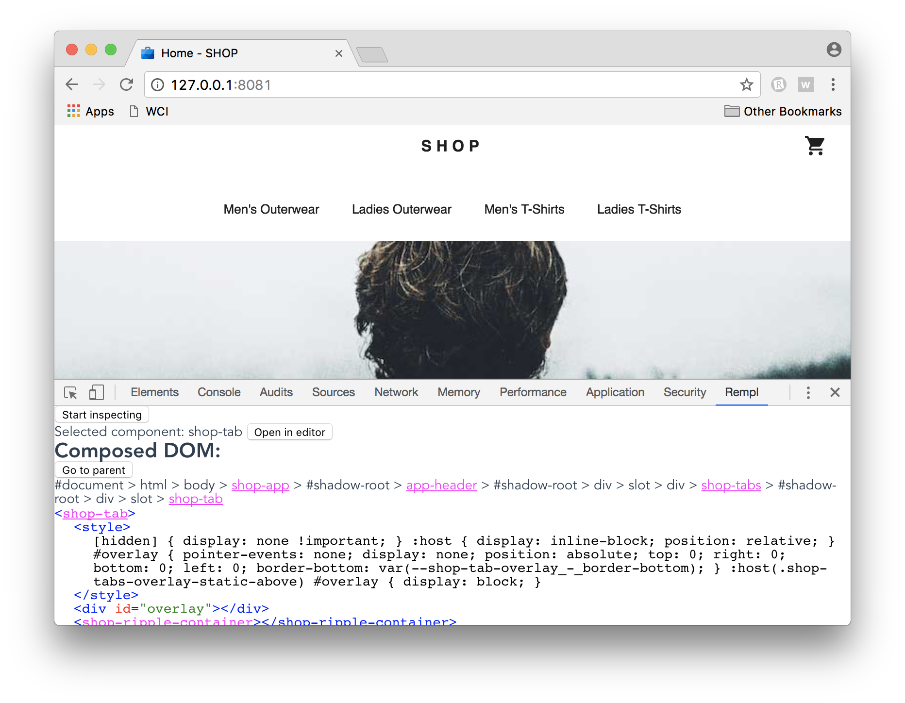
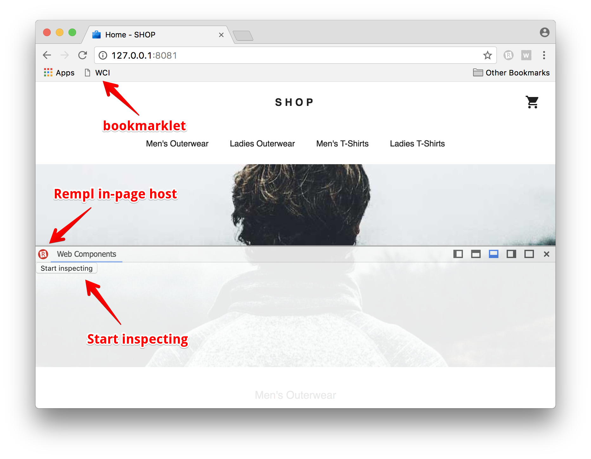
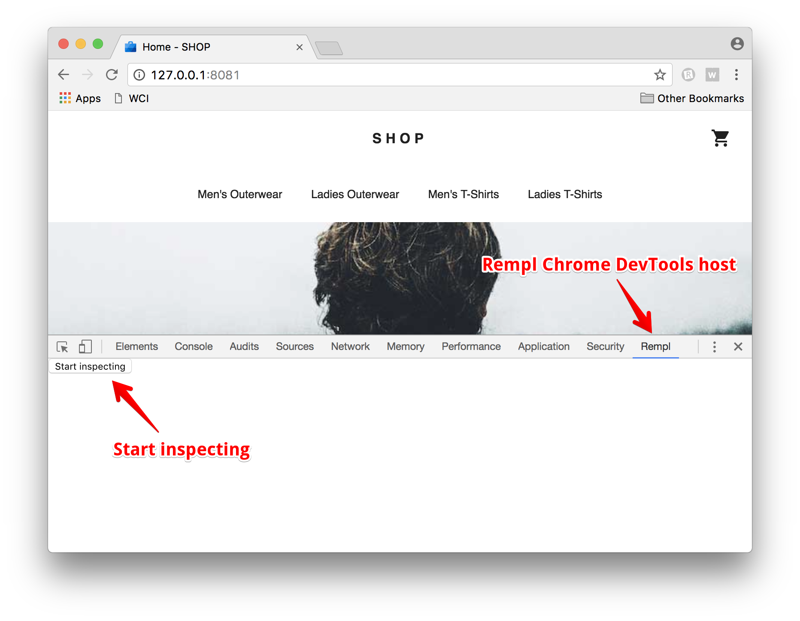

# Web Components Inspector (supports Polymer)

This tool gets inspiration from existing tools like [component-inspector](https://github.com/lahmatiy/component-inspector/) and similar ones for Vue ([vue-devtools](https://github.com/vuejs/vue-devtools)), React ([react-devtools](https://github.com/facebook/react-devtools)), Angular ([augury](https://github.com/rangle/augury)), etc... For now it is more a PoC that such a tool can be developed for Custom Elements and ShadowDOM (and friends) to provide a tree of Web Components with the ability to navigate between nodes. UX needs to be improved a lot, lots of features are still to be done, but in certain cases you can play and benefit from it right now. Stay tuned!



## Usage

### Cross-browser

1. Install CLI:

    ```sh
    npm install -g web-components-inspector
    ```

1. In terminal run CLI in you project root to start the server:

    ```sh
    cd path/to/my/project
    wci         # run server on a default port 9247
    wci -e code # with open-in-editor feature (VSCode)
    wci --help  # look at all available options
    ```

1. Create "WCI" [bookmarklet](https://en.wikipedia.org/wiki/Bookmarklet) in your browser:

    ```javascript
    javascript:(function() {
      var s = document.createElement('script');
      s.src = 'http://127.0.0.1:9247/publisher.js';
      s.onload = function() {
        s.remove();
        var m = document.createElement('meta');
        m.name = 'wci:inpage-host';
        document.head.appendChild(m);
      };
      document.head.appendChild(s);
    })();
    ```

1. Open page with Web Components (for example [Shop app](https://github.com/Polymer/shop)) and click on the bookmarklet to load and activate the inspector.

1. Start inspecting :telescope:



### Chrome Extension

1. Install [Rempl extension](https://chrome.google.com/webstore/detail/rempl/hcikjlholajopgbgfmmlbmifdfbkijdj), a platform that will host Web Components Inspector in the Chrome DevTools panel. For more information about it visit [Rempl GitHub repository](https://github.com/rempl/rempl).

1. Install [Web Components Inspector extension](https://chrome.google.com/webstore/detail/web-components-inspector/dhghhonjboahenmhpfdnmocbkijjcgdc).

1. Open page with Web Components (for example [Shop app](https://github.com/Polymer/shop)) and activate DevTools => Rempl panel.

1. To activate open-in-editor feature, you still need to run a server. You can either use the CLI (see cross-browser usage, steps 1-2), or use a server specifically created for this feature (on port 9247 which the extension expects):

    ```sh
    npm install -g open-in-editor-server
    cd path/to/my/project
    open-in-editor-serve -e code -p 9247 # run server on a port 9247 and open files in VSCode
    open-in-editor-serve --help  # look at all available options
    ```

1. Start inspecting :telescope:


